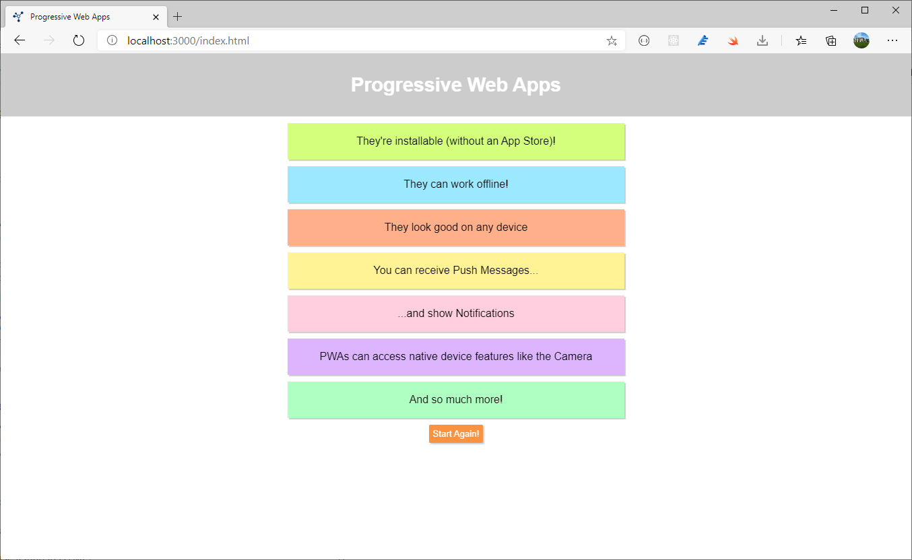

# Progressive Web Apps - First Example
This source code is part of a series of posts on [PureSourceCode](https://www.puresourcecode.com/).

- [Intro to PWAs and Service Workers](https://www.puresourcecode.com/javascript/intro-to-pwas-and-service-workers/)
- [The Service Worker Lifecycle with PWA](https://www.puresourcecode.com/javascript/the-service-worker-lifecycle-with-pwa/)

# How to Use
You need [Node.js](https://nodejs.org) installed on your machine. Simply download the installer from [nodejs.org](https://nodejs.org) and go through the installation steps.

Once Node.js is installed, open your command prompt or terminal and **navigate into this project folder**. There, run `npm install` to install all required dependencies.

Finally, run `npm start` to start the development server and visit [localhost:3000](http://localhost:3000) to see the running application.

# Screenshot

